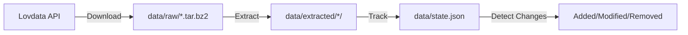

# lovdata-processing


[](https://github.com/copier-org/copier)

**Keep Norwegian legal documents in sync. Automatically.**

## Why This Exists

Lovdata publishes Norwegian laws and regulations as downloadable datasets. These datasets update frequently—laws change, new regulations appear, old ones are amended. Manually tracking what changed is tedious and error-prone.

This tool solves that:

- **Download** datasets from Lovdata's API
- **Extract** compressed archives automatically
- **Track** exactly which files were added, modified, or removed
- **Sync** incrementally—only process what changed since last run

Built for developers building legal tech, researchers analyzing legal data, or anyone who needs reliable, up-to-date Norwegian legal documents.

## Important: How Lovdata's API Works

Lovdata provides bulk dataset downloads—not individual file checksums or change feeds. This means:

- **Filenames are stable identifiers** - `LOV-1999-07-02-63.xml` never changes, even when the law's content is amended
- **No file-level change detection** - The API only provides dataset-level `lastModified` timestamps
- **All changes are detected** - Both regulatory amendments and Lovdata's editorial updates trigger change notifications

**Why content hashing?** Since the API doesn't provide checksums or change indicators for individual files, this tool computes xxHash for each file to detect modifications. This is the only reliable way to identify which specific documents changed.

**Result:** You get precise change detection, but cannot programmatically distinguish between legal amendments and editorial updates. Manual review recommended for critical changes.

Official API docs: https://api.lovdata.no/publicData

## Quick Start

```bash
# Install dependencies
uv sync

# Sync everything (first run downloads all datasets)
uv run lov run

# Second run? Only processes changes
uv run lov run
```

That's it. Your datasets are in `data/extracted/`, and you know exactly what changed.

## How It Works

### The Workflow



1. **Download** - Fetches dataset archives from Lovdata's API
2. **Extract** - Uncompresses tar.bz2 files into organized directories
3. **Track** - Computes xxHash for each file and compares against previous hashes
4. **Report** - Shows exactly what changed since last run

### Your Data Structure

After running `lov run`, you get:

```
data/
├── raw/
│   ├── gjeldende-lover.tar.bz2           # Downloaded archives
│   └── gjeldende-sentrale-forskrifter.tar.bz2
├── extracted/
│   ├── gjeldende-lover/
│   │   └── nl/
│   │       ├── nl-18840614-003.xml        # Extracted legal documents
│   │       ├── nl-18880623-003.xml
│   │       └── ...
│   └── gjeldende-sentrale-forskrifter/
│       └── sf/
│           └── ...
└── state.json                             # Tracks file changes
```

## Common Tasks

### See What Changed

```bash
# List all added files
uv run lov files list --status added

# See statistics
uv run lov files stats
```

**Output example:**

```
Dataset Statistics
┌────────────────────┬───────┬──────────┬─────────┐
│ Dataset            │ Added │ Modified │ Removed │
├────────────────────┼───────┼──────────┼─────────┤
│ gjeldende-lover    │   245 │       12 │       3 │
└────────────────────┴───────┴──────────┴─────────┘
```

### Clean Up Removed Files

When Lovdata removes documents from their dataset, they linger in `data/extracted/`. Clean them up:

```bash
# Preview what would be deleted
uv run lov files prune --dry-run

# Actually remove them
uv run lov files prune
```

### Filter Specific Datasets

Only want "gjeldende" (current) laws?

```bash
# Set in .env
LOVDATA_DATASET_FILTER=gjeldende

# Or via code
uv run lov run --filter gjeldende
```

### Force Re-download

Already have datasets but want fresh copies?

```bash
uv run lov download --force
```

## Use as Python SDK

### Simple: Just Sync Everything

```python
from lovdata_processing import sync_datasets

# Downloads, extracts, tracks changes - all in one call
sync_datasets()
```

**What happens:**

1. Downloads all datasets from Lovdata API
2. Extracts archives to `data/extracted/`
3. Updates `data/state.json` with file hashes
4. Shows progress bars and summary

### Custom Paths and Filters

```python
from lovdata_processing import sync_datasets, PipelineConfig
from pathlib import Path

config = PipelineConfig(
    dataset_filter="gjeldende",              # Only current laws
    raw_data_dir=Path("my_data/archives"),
    extracted_data_dir=Path("my_data/docs"),
    max_download_concurrency=8               # Download 8 files at once
)

sync_datasets(config=config)
```

### Query What Changed

Perfect for automation—run this after syncing to see what's new:

```python
from lovdata_processing import PipelineConfig, PipelineStateManager, FileStatus
from lovdata_processing.domain.services import FileQueryService

config = PipelineConfig()
query = FileQueryService()

with PipelineStateManager(config.state_file) as state:
    # Get files added in the last sync
    new_files = query.get_files_by_status(
        state.data,
        FileStatus.ADDED,
        limit=100
    )

    for file_meta in new_files:
        print(f"New: {file_meta.path}")

    # Get statistics per dataset
    stats = query.get_dataset_statistics(state.data)
    for dataset_name, counts in stats.items():
        print(f"{dataset_name}: {counts['added']} added, {counts['modified']} modified")
```

### Build a Processing Pipeline

```python
from lovdata_processing import DatasetSyncOrchestrator, PipelineConfig
from pathlib import Path

# 1. Configure
config = PipelineConfig(dataset_filter="gjeldende")
orchestrator = DatasetSyncOrchestrator(config)

# 2. Sync datasets
orchestrator.sync_datasets(force_download=False)

# 3. Process new files
from lovdata_processing.domain.services import FileQueryService
query = FileQueryService()

with PipelineStateManager(config.state_file) as state:
    added_files = query.get_files_by_status(state.data, FileStatus.ADDED)

    for file_meta in added_files:
        xml_path = config.extracted_data_dir / file_meta.path
        # Your processing logic here
        process_legal_document(xml_path)
```

**Real-world use cases:**

- **Legal search engine**: Index new/modified documents in Elasticsearch
- **Change notifications**: Email alerts when specific laws are updated
- **Data warehouse**: ETL pipeline to load legal data into database
- **Analysis**: Track trends in legal changes over time

See [`examples/sdk_usage.py`](examples/sdk_usage.py) for complete examples.

## Configuration

### Environment Variables

Create a `.env` file for persistent settings:

```bash
# API settings
LOVDATA_API_TIMEOUT=30

# Dataset filtering
LOVDATA_DATASET_FILTER=gjeldende    # Only "gjeldende" datasets
# LOVDATA_DATASET_FILTER=null       # All datasets

# Performance
LOVDATA_MAX_DOWNLOAD_CONCURRENCY=4  # Parallel downloads
```

### Programmatic Configuration

```python
from lovdata_processing import Settings

# Override environment variables
settings = Settings(
    api_timeout=60,
    max_download_concurrency=8
)
```

| Variable                           | Default     | What It Does                              |
| ---------------------------------- | ----------- | ----------------------------------------- |
| `LOVDATA_API_TIMEOUT`              | `30`        | Seconds before API requests timeout       |
| `LOVDATA_DATASET_FILTER`           | `gjeldende` | Filter datasets by name (or `null` = all) |
| `LOVDATA_MAX_DOWNLOAD_CONCURRENCY` | `4`         | How many files to download in parallel    |

## Limitations

See "Important: How Lovdata's API Works" section above for context on API constraints.

- **Not real-time** - Requires periodic polling (no webhooks available)
- **Storage needed** - Local hashes in `state.json` (~5-15 MB) + extracted XML files (several GB)
- **Change detection only** - Identifies *that* a file changed, not *what* or *why*
- **Full dataset downloads** - Entire archives must be re-downloaded when any file changes

## FAQ

**Q: What happens if a sync is interrupted?**
A: State is only saved after successful completion. Just run again.

**Q: Can I filter to only track specific laws?**
A: Yes, use the query API after syncing to filter by status, dataset name, or file patterns. See examples in "Use as Python SDK" section above.

## License

MIT
