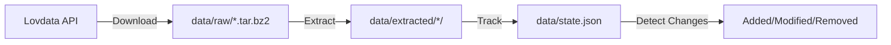

# lovdata-processing


[](https://github.com/copier-org/copier)

**Keep Norwegian legal documents in sync. Automatically.**

## Why This Exists

Lovdata publishes Norwegian laws and regulations as downloadable datasets. These datasets update frequently—laws change, new regulations appear, old ones are amended. Manually tracking what changed is tedious and error-prone.

This tool solves that:

- **Download** datasets from Lovdata's API
- **Extract** compressed archives automatically
- **Track** exactly which files were added, modified, or removed
- **Sync** incrementally—only process what changed since last run

Built for developers building legal tech, researchers analyzing legal data, or anyone who needs reliable, up-to-date Norwegian legal documents.

## Understanding Lovdata's Data Distribution Model

Before using this tool, it's important to understand how Lovdata distributes legal documents and why this tool is designed the way it is.

### How Lovdata Works

Lovdata provides legal documents through bulk dataset downloads (`/v1/publicData/list` and `/v1/publicData/get`). Each dataset is a compressed archive (`.tar.bz2`) containing thousands of XML files representing individual laws and regulations.

**Critical characteristics:**

1. **Stable filenames within datasets** - Individual law filenames follow the pattern `{type}-{announcement_date}-{law_number}.xml` (e.g., `LOV-1999-07-02-63.xml` for Personopplysningsloven). These filenames **never change** throughout a law's lifetime, even when the law's content is substantially modified.

2. **Two types of document changes**:
   - **Regulatory changes**: Actual legal amendments from government authorities (what you probably care about)
   - **Maintenance changes**: Lovdata's editorial corrections, formatting updates, and schema improvements

   **The bulk dataset API provides no way to distinguish these change types programmatically.** Both will appear as modified files.

3. **No individual file checksums** - Lovdata's public data API does not provide:
   - Individual file checksums or ETags
   - A manifest file listing current document hashes
   - A changelog or update feed
   - Reliable change indicators in file metadata

   This is an acknowledged limitation of the current API design.

4. **Dataset-level timestamps only** - The API provides `lastModified` timestamps for entire datasets, but not for individual files within those datasets. You cannot determine which specific files changed without downloading and comparing content.

### Why This Tool Uses Content Hashing

Given these API characteristics, traditional change detection approaches don't work:

- ❌ **Filename monitoring**: Filenames never change, so this won't detect updates
- ❌ **Timestamp checking**: Only available at dataset level, not individual files
- ❌ **Server-provided checksums**: Not available in the API
- ✅ **Content hashing**: The only reliable method to detect document changes

This tool computes **xxHash checksums** for each extracted file and stores them locally in `data/state.json`. xxHash provides:
- Fast computation (10x faster than SHA256, important for large document sets)
- Deterministic output (same content always produces same hash)
- Low collision probability (different content produces different hashes)

**Result**: You get precise change detection—every modified file is identified, whether the change is a major legal amendment or a minor formatting correction.

### What This Tool Can and Cannot Do

**✅ This tool reliably:**
- Detects when any document has been added, modified, or removed
- Tracks the exact state of all files across sync runs
- Provides incremental updates (only downloads changed datasets)
- Computes deterministic content hashes for change verification

**❌ This tool cannot:**
- Distinguish between regulatory changes and editorial/formatting updates
- Provide real-time notifications (requires periodic polling)
- Identify what content changed within a document (only that it changed)
- Filter changes by legal significance (all changes are detected)

**Recommendation**: Use this tool to detect changes, then implement your own content analysis or manual review process to determine which changes are legally significant for your use case.

### Official Lovdata API Documentation

- Public Data API: https://api.lovdata.no/publicData (bulk dataset downloads)
- API Documentation: https://api.lovdata.no/xmldocs (general API documentation)

## Quick Start

```bash
# Install dependencies
uv sync

# Sync everything (first run downloads all datasets)
uv run lov run

# Second run? Only processes changes
uv run lov run
```

That's it. Your datasets are in `data/extracted/`, and you know exactly what changed.

## How It Works

### The Workflow



1. **Download** - Fetches dataset archives from Lovdata's API (only downloads datasets with updated `lastModified` timestamps)
2. **Extract** - Uncompresses tar.bz2 files into organized directories
3. **Track** - Computes xxHash for each file and compares against previous hashes (required because Lovdata doesn't provide file-level checksums)
4. **Report** - Shows you exactly what changed since last run (added, modified, or removed files)

### Your Data Structure

After running `lov run`, you get:

```
data/
├── raw/
│   ├── gjeldende-lover.tar.bz2           # Downloaded archives
│   └── gjeldende-sentrale-forskrifter.tar.bz2
├── extracted/
│   ├── gjeldende-lover/
│   │   └── nl/
│   │       ├── nl-18840614-003.xml        # Extracted legal documents
│   │       ├── nl-18880623-003.xml
│   │       └── ...
│   └── gjeldende-sentrale-forskrifter/
│       └── sf/
│           └── ...
└── state.json                             # Tracks file changes
```

## Common Tasks

### See What Changed

```bash
# List all added files
uv run lov files list --status added

# See statistics
uv run lov files stats
```

**Output example:**

```
Dataset Statistics
┌────────────────────┬───────┬──────────┬─────────┐
│ Dataset            │ Added │ Modified │ Removed │
├────────────────────┼───────┼──────────┼─────────┤
│ gjeldende-lover    │   245 │       12 │       3 │
└────────────────────┴───────┴──────────┴─────────┘
```

### Clean Up Removed Files

When Lovdata removes documents from their dataset, they linger in `data/extracted/`. Clean them up:

```bash
# Preview what would be deleted
uv run lov files prune --dry-run

# Actually remove them
uv run lov files prune
```

### Filter Specific Datasets

Only want "gjeldende" (current) laws?

```bash
# Set in .env
LOVDATA_DATASET_FILTER=gjeldende

# Or via code
uv run lov run --filter gjeldende
```

### Force Re-download

Already have datasets but want fresh copies?

```bash
uv run lov download --force
```

## Use as Python SDK

### Simple: Just Sync Everything

```python
from lovdata_processing import sync_datasets

# Downloads, extracts, tracks changes - all in one call
sync_datasets()
```

**What happens:**

1. Downloads all datasets from Lovdata API
2. Extracts archives to `data/extracted/`
3. Updates `data/state.json` with file hashes
4. Shows progress bars and summary

### Custom Paths and Filters

```python
from lovdata_processing import sync_datasets, PipelineConfig
from pathlib import Path

config = PipelineConfig(
    dataset_filter="gjeldende",              # Only current laws
    raw_data_dir=Path("my_data/archives"),
    extracted_data_dir=Path("my_data/docs"),
    max_download_concurrency=8               # Download 8 files at once
)

sync_datasets(config=config)
```

### Query What Changed

Perfect for automation—run this after syncing to see what's new:

```python
from lovdata_processing import PipelineConfig, PipelineStateManager, FileStatus
from lovdata_processing.domain.services import FileQueryService

config = PipelineConfig()
query = FileQueryService()

with PipelineStateManager(config.state_file) as state:
    # Get files added in the last sync
    new_files = query.get_files_by_status(
        state.data,
        FileStatus.ADDED,
        limit=100
    )

    for file_meta in new_files:
        print(f"New: {file_meta.path}")
        # Note: This includes ALL changes (regulatory + editorial/formatting)
        # You'll need your own logic to determine which changes matter

    # Get statistics per dataset
    stats = query.get_dataset_statistics(state.data)
    for dataset_name, counts in stats.items():
        print(f"{dataset_name}: {counts['added']} added, {counts['modified']} modified")
```

### Build a Processing Pipeline

```python
from lovdata_processing import DatasetSyncOrchestrator, PipelineConfig
from pathlib import Path

# 1. Configure
config = PipelineConfig(dataset_filter="gjeldende")
orchestrator = DatasetSyncOrchestrator(config)

# 2. Sync datasets
orchestrator.sync_datasets(force_download=False)

# 3. Process new files
from lovdata_processing.domain.services import FileQueryService
query = FileQueryService()

with PipelineStateManager(config.state_file) as state:
    added_files = query.get_files_by_status(state.data, FileStatus.ADDED)

    for file_meta in added_files:
        xml_path = config.extracted_data_dir / file_meta.path
        # Your processing logic here
        process_legal_document(xml_path)
```

**Real-world use cases:**

- **Legal search engine**: Index new/modified documents in Elasticsearch
- **Change notifications**: Email alerts when specific laws are updated
- **Data warehouse**: ETL pipeline to load legal data into database
- **Analysis**: Track trends in legal changes over time

See [`examples/sdk_usage.py`](examples/sdk_usage.py) for complete examples.

## Configuration

### Environment Variables

Create a `.env` file for persistent settings:

```bash
# API settings
LOVDATA_API_TIMEOUT=30

# Dataset filtering
LOVDATA_DATASET_FILTER=gjeldende    # Only "gjeldende" datasets
# LOVDATA_DATASET_FILTER=null       # All datasets

# Performance
LOVDATA_MAX_DOWNLOAD_CONCURRENCY=4  # Parallel downloads
```

### Programmatic Configuration

```python
from lovdata_processing import Settings

# Override environment variables
settings = Settings(
    api_timeout=60,
    max_download_concurrency=8
)
```

| Variable                           | Default     | What It Does                              |
| ---------------------------------- | ----------- | ----------------------------------------- |
| `LOVDATA_API_TIMEOUT`              | `30`        | Seconds before API requests timeout       |
| `LOVDATA_DATASET_FILTER`           | `gjeldende` | Filter datasets by name (or `null` = all) |
| `LOVDATA_MAX_DOWNLOAD_CONCURRENCY` | `4`         | How many files to download in parallel    |

## Limitations and Caveats

### Expected Behavior

**You will be notified of ALL changes**, including:
- Major legal amendments requiring compliance review ✅
- Minor typo corrections that don't affect legal meaning ⚠️
- Formatting updates from Lovdata ⚠️
- XML schema changes ⚠️
- HTML structure modifications ⚠️

There is no programmatic way to filter these out. All changes trigger hash mismatches.

### Not Real-Time

This tool requires **periodic polling** of the Lovdata API. There is no webhook or push notification system available.

**Recommended approach**: Run `uv run lov run` on a schedule (e.g., daily via cron) and process the detected changes.

### Storage Requirements

All document hashes must be stored locally in `data/state.json`. For the complete Norwegian legal corpus:
- `state.json` size: Approximately 5-15 MB (depends on number of tracked documents)
- Extracted XML files: Several GB (all legal documents in XML format)

### Detection Reliability

**What the hash comparison tells you:**
- ✅ A file was added (new hash, no previous record)
- ✅ A file was modified (hash changed from previous value)
- ✅ A file was removed (previously tracked, now absent from dataset)

**What it doesn't tell you:**
- ❌ What content changed within the file
- ❌ Why the file changed (regulatory vs. editorial)
- ❌ Whether the change is legally significant
- ❌ Which specific paragraphs or sections were modified

**Recommendation**: Implement a diff viewer or manual review workflow to analyze the nature of changes for files that matter to your use case.

### Bandwidth and Processing Considerations

**Initial sync:**
- Downloads all filtered datasets (multiple GB)
- Extracts all archives
- Computes hashes for all files
- Can take 10-30 minutes depending on network speed and dataset size

**Subsequent syncs:**
- Only downloads datasets with updated `lastModified` timestamps
- Re-extracts and re-hashes those datasets
- Typically faster (minutes, not hours)

**Note**: Even if only one file changed in a dataset, the entire dataset archive must be downloaded and extracted because Lovdata doesn't provide file-level download endpoints.

## FAQ

**Q: What happens if a sync is interrupted?**
A: State is only saved after successful completion. Interrupted syncs leave previous state intact—just run again.

**Q: Can I process files while syncing?**
A: Not recommended. Sync first, then query state for new files and process them separately.

**Q: Do I need to download everything every time?**
A: No. After the first run, only datasets with updated `lastModified` timestamps are downloaded.

**Q: What if Lovdata's API changes?**
A: The `acquisition` layer isolates API details. Updates happen there without touching business logic.

**Q: Why am I seeing so many change notifications?**
A: You're receiving notifications for both regulatory changes and Lovdata maintenance updates. The API provides no way to distinguish these. Consider implementing manual review workflows or content analysis to filter changes relevant to your use case.

**Q: Can I use dataset `lastModified` timestamps to detect only important changes?**
A: No. Dataset timestamps update for both content changes and maintenance activities. Only file-level content hashing reliably detects which specific documents were modified.

**Q: A filename changed but the tool didn't detect it—is it broken?**
A: Lovdata filenames within datasets never change after initial creation. This is expected behavior, not a bug. The tool detects content changes, not filename changes.

**Q: Can this tool tell me exactly what changed in a law?**
A: No. The tool only detects that a change occurred (via hash comparison). To see what changed, you need to:
   1. Retrieve the old version (from your previous sync data or version control)
   2. Compare it against the new version using a diff tool or XML comparison library
   3. Analyze the differences manually or programmatically

**Q: How can I filter changes to only track specific laws or regulations?**
A: After running `uv run lov run`, use the query API to filter files:
   ```python
   from lovdata_processing import FileQueryService, PipelineStateManager, PipelineConfig

   query = FileQueryService()
   config = PipelineConfig()

   with PipelineStateManager(config.state_file) as state:
       # Filter by status and dataset
       modified_laws = query.get_files_by_filter(
           state.data,
           status="modified",
           dataset="gjeldende-lover"  # Only current laws
       )

       # Then filter further by specific law patterns
       personvern_changes = [
           f for f in modified_laws
           if "personopplysning" in f["path"].lower()
       ]
   ```

## When to Use This Tool

**✅ Good fit if you need:**
- Automated detection of any document changes in Norwegian legal datasets
- Reliable change tracking with local state management
- Incremental sync capability (only process what changed)
- Programmatic access to change data for automation workflows
- A foundation for building legal monitoring, compliance, or research tools

**❌ Not a good fit if you need:**
- Real-time push notifications of legal changes (API doesn't support webhooks)
- Automatic filtering of insignificant editorial changes (not possible with available API data)
- Individual document downloads without processing full datasets (API only provides bulk archives)
- Built-in diff viewing or change analysis (tool only detects changes, doesn't analyze them)

**Alternative approaches to consider:**
- If you only need to track a small number of specific laws, you might prefer manually checking Lovdata's website or using their web interface
- If you need semantic change analysis, consider building a content analysis layer on top of this tool's change detection
- If you need real-time alerts, you might need to poll this tool frequently (e.g., hourly) and implement your own notification system

## License

MIT
